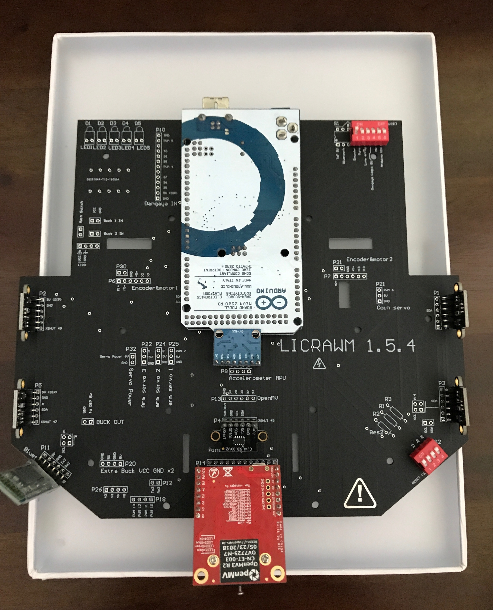
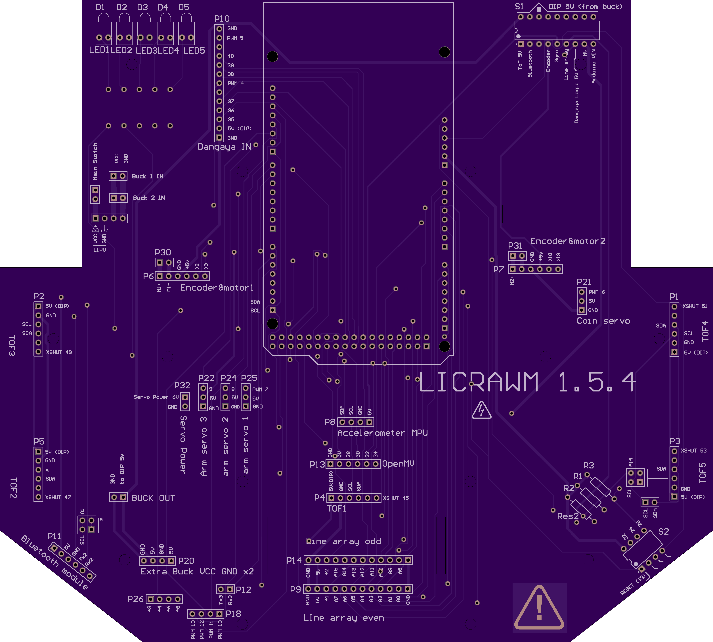
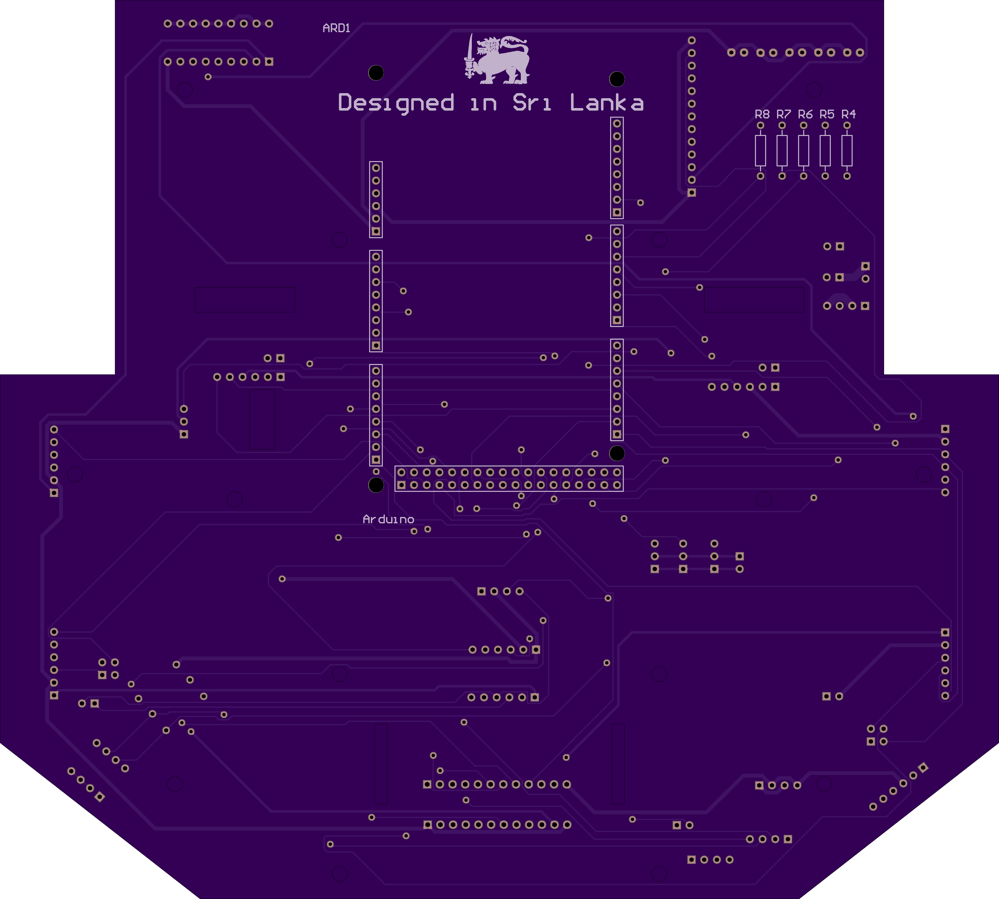
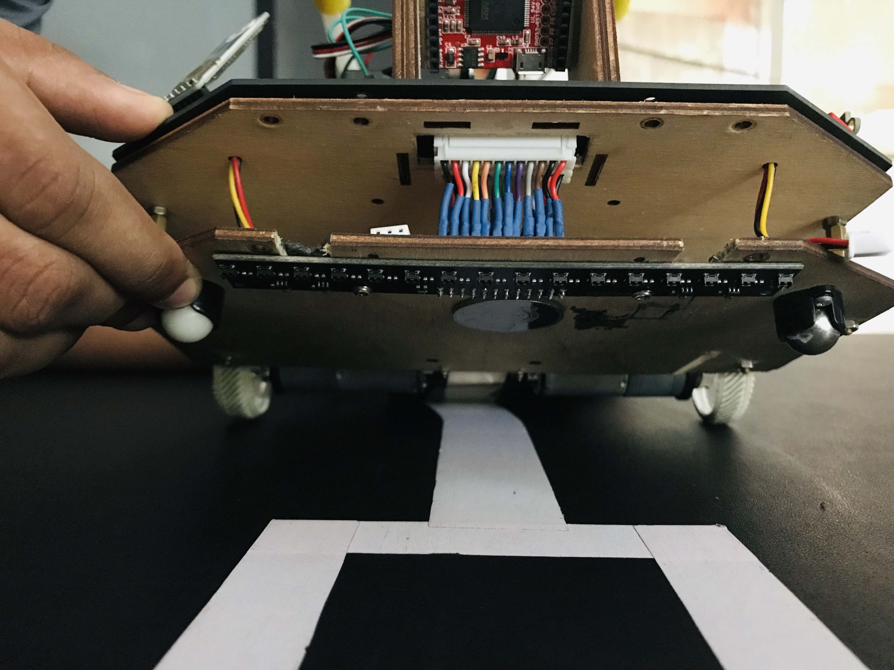
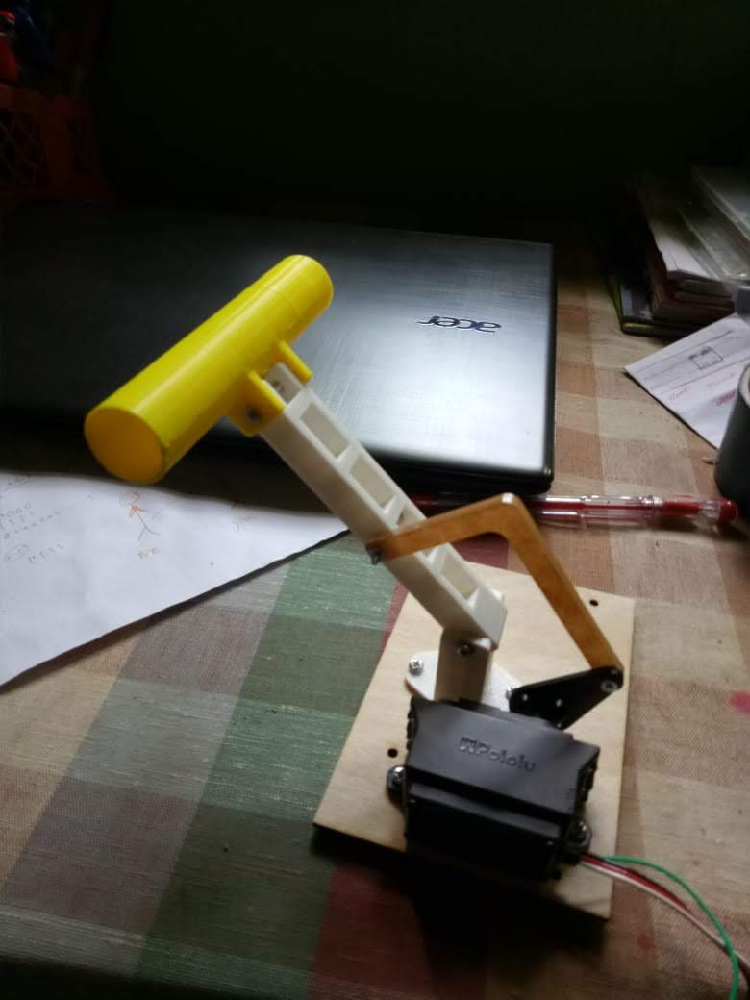
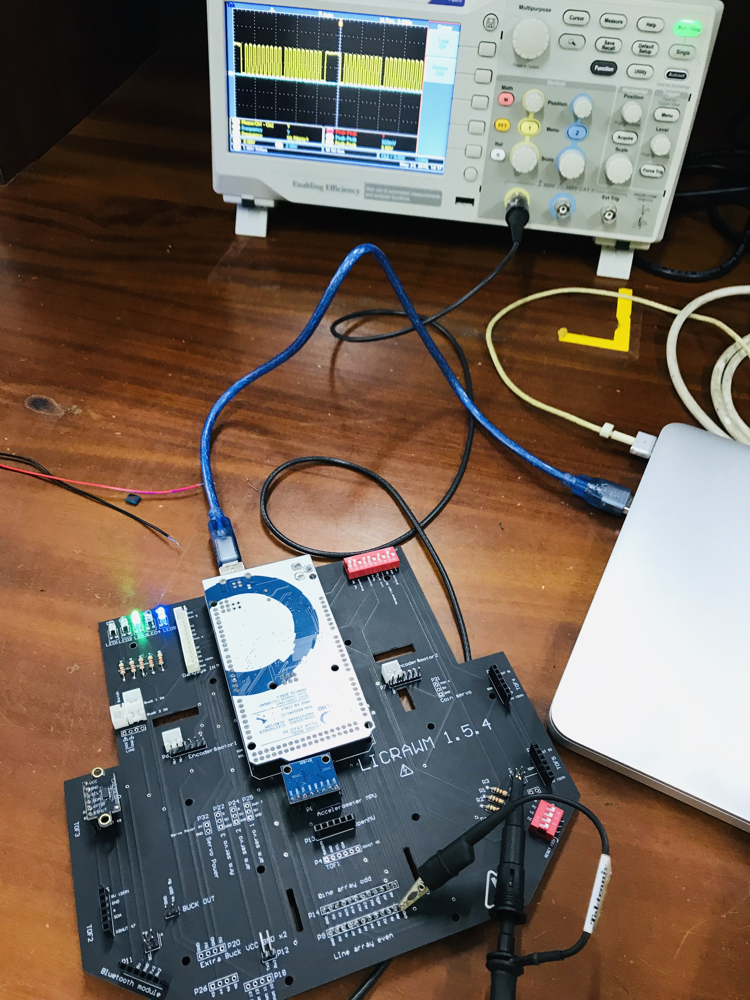
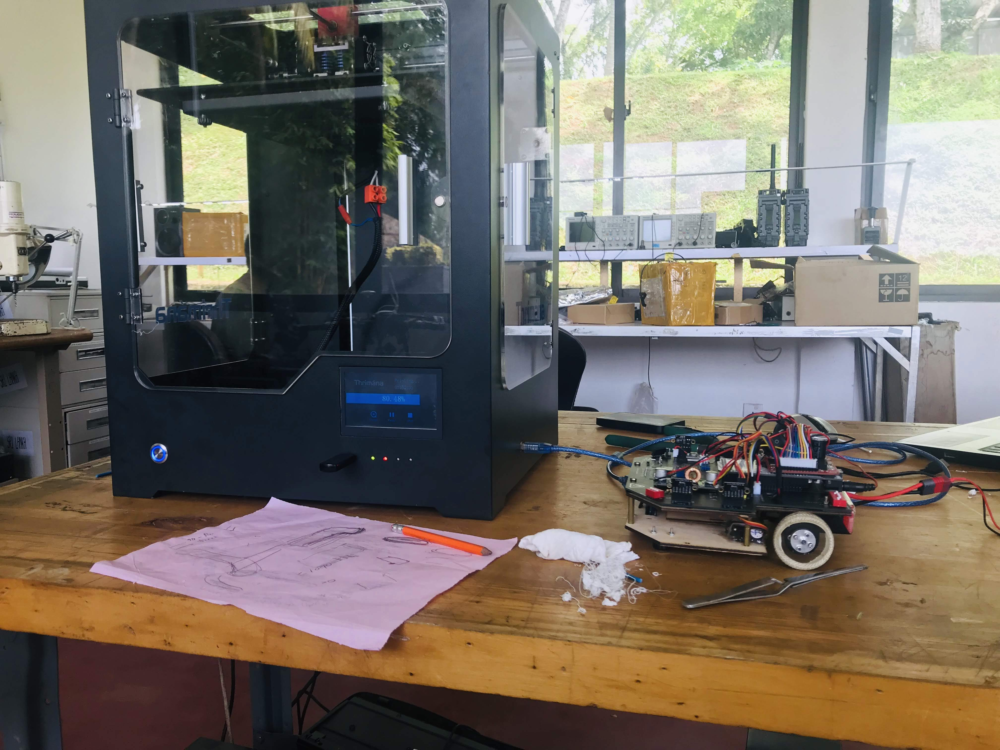

# LICRAWMv1

## Custom Designed PCB

 
 

 

 

 

  <tr>
    <td>  </td>
    <td>  </td>
   </tr>

  <tr>
    <td>  </td>
    <td>  </td>
   </tr>
 

 ## 3D Printed Parts

  <tr>
    <td></td>
   </tr>
  
 
 ## Robot Visualizer (written in javascript) 

   <tr>
    <td></td>
    <td></td>
   </tr>

  
 ## Testing  
 
 

   <tr>
    <td></td>
    <td></td>
   </tr>
 
  <tr>
    <td></td>
   </tr>
   

Team ♥

